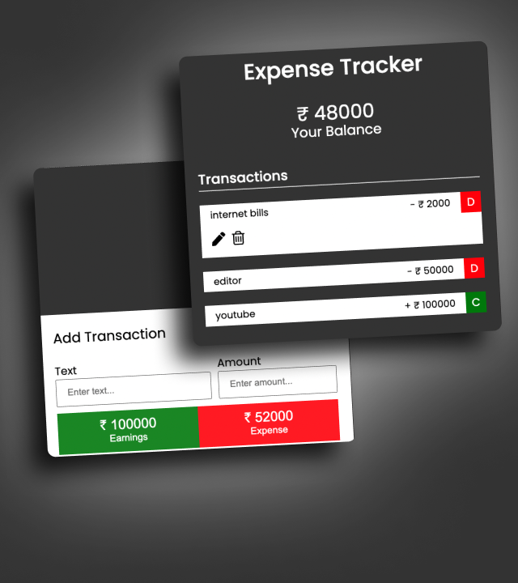

# Expense-Tracker-App-
Just test my HTML CSS  JS skills to build this small project hope its helpful for you also
# Expense Tracker App

The Expense Tracker App allows users to track their expenses and earnings, helping them maintain a clear overview of their financial transactions.

## Demo

You can check out the live demo of the app [here](#) (insert the link to your live demo if available).

## Features

- Add transactions with descriptions and amounts.
- Categorize transactions as earnings or expenses.
- Display current balance, total earnings, and total expenses.
- Edit and delete transactions.
- Responsive design for various screen sizes.

## Screenshots

Include screenshots of your app's interface here to give users a visual idea of what the app looks like.

## How to Use

1. Clone the repository:

2. Open the `index.html` file in your web browser or host it on a web server.

3. Enter transaction details (description and amount) in the input fields.
4. Choose whether the transaction is an earning or an expense using the respective buttons.
5. Click the "Add Transaction" button to record the transaction.

6. Edit a transaction by clicking the edit icon next to it. Make changes and save.
7. Delete a transaction by clicking the delete icon next to it.

## Dependencies

- None

## Compatibility

The app has been tested on the following browsers:

- Google Chrome
- Mozilla Firefox
- Microsoft Edge

## Contributing

Contributions are welcome! If you find any issues or want to enhance the app, feel free to create a pull request.

## License

This project is licensed under the [MIT License](LICENSE).

## Credits

- [OpenAI GPT-3.5](https://openai.com/)

## Author

- [Mk-Muzzammil](https://github.com/mk-muzzammil)

---
Note: Replace the placeholders (e.g., `your-username`, `your-name`, `expense-tracker-app`, `your-link`, etc.) with the appropriate values specific to your project.
